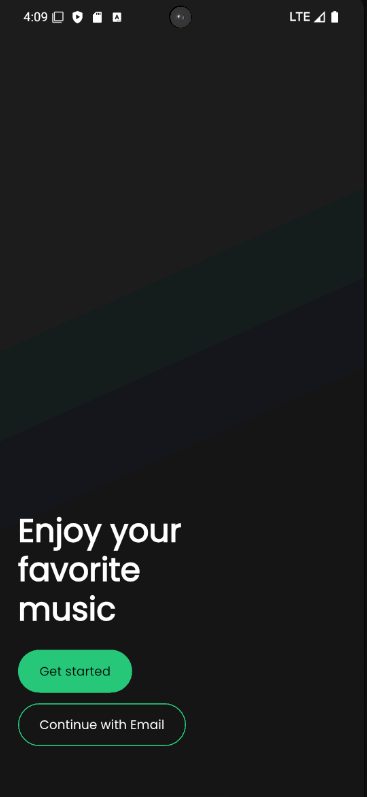
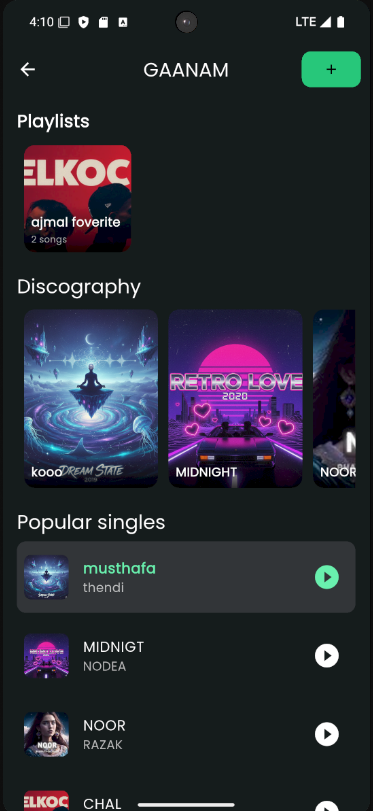
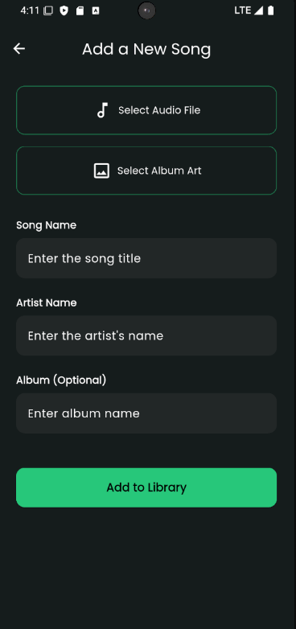
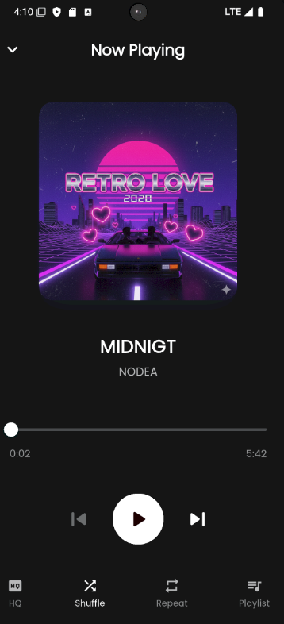

# 🎵 GAANAM - Flutter Music Streaming App

A beautiful, feature-rich music streaming application built with Flutter and Firebase. Stream your favorite songs, create playlists, and enjoy a seamless music experience.


## ✨ Features

### 🎶 Music Playback
- High-quality audio streaming
- Play, pause, seek, skip controls
- Previous/Next track navigation
- Progress bar with real-time updates
- Background audio playback support

### 📱 User Interface
- Modern, elegant dark theme
- Smooth animations and transitions
- Cached album artwork for faster loading
- Responsive design for all screen sizes
- Pull-to-refresh functionality

### 🎼 Playlist Management
- Create custom playlists
- Add songs to multiple playlists
- Dynamic playlist cards with song count
- Album-based organization
- Quick access to favorite collections

### 🎚️ Advanced Controls
- Shuffle mode
- Repeat modes (Off, All, One)
- Queue management
- Volume controls
- Persistent playback preferences

### 📤 Content Management
- Upload audio files (MP3, WAV, etc.)
- Add album artwork
- Metadata editing (Title, Artist, Album)
- Drag-and-drop file selection
- Progress tracking during uploads

### 🔍 Organization
- Group songs by album
- Artist-based filtering
- Discography view
- Popular singles section
- Search functionality (ready for implementation)

## 📸 Screenshots

<p align="center">
  
  
  
   
</

## 🚀 Getting Started

### Prerequisites

Before you begin, ensure you have the following installed:
- [Flutter SDK](https://flutter.dev/docs/get-started/install) (3.0.0 or higher)
- [Dart SDK](https://dart.dev/get-dart) (3.0.0 or higher)
- [Android Studio](https://developer.android.com/studio) or [VS Code](https://code.visualstudio.com/)
- [Firebase CLI](https://firebase.google.com/docs/cli)
- An active Firebase project

### Installation

1. **Clone the repository**
```bash
git clone https://github.com/yourusername/gaanam-music-app.git
cd gaanam-music-app
```

2. **Install dependencies**
```bash
flutter pub get
```

3. **Configure Firebase**

   - Create a new Firebase project at [Firebase Console](https://console.firebase.google.com/)
   - Enable the following services:
     - Firestore Database
     - Firebase Storage
     - Firebase Authentication (optional, for future features)
   
   - Download and add configuration files:
     - `google-services.json` for Android (place in `android/app/`)
     - `GoogleService-Info.plist` for iOS (place in `ios/Runner/`)

4. **Update Firebase configuration**

   Replace the Firebase configuration in `lib/firebase_options.dart` with your project credentials.

5. **Set up Firestore Database**

   Create the following collections in Firestore:
   
   **Collection: `songs`**
   ```json
   {
     "title": "Song Title",
     "artist": "Artist Name",
     "album": "Album Name",
     "audioUrl": "https://storage.googleapis.com/...",
     "imageUrl": "https://storage.googleapis.com/...",
     "duration": 240,
     "addedAt": "2025-01-01T00:00:00.000Z"
   }
   ```

   **Collection: `playlists`**
   ```json
   {
     "title": "Playlist Name",
     "imageUrl": "https://storage.googleapis.com/...",
     "songs": [
       {
         "id": "song_id",
         "title": "Song Title",
         "artist": "Artist Name",
         "audioUrl": "https://...",
         "imageUrl": "https://...",
         "album": "Album Name"
       }
     ]
   }
   ```

6. **Configure Firebase Storage Rules**

   ```javascript
   rules_version = '2';
   service firebase.storage {
     match /b/{bucket}/o {
       match /songs/{allPaths=**} {
         allow read: if true;
         allow write: if request.auth != null;
       }
       match /album_art/{allPaths=**} {
         allow read: if true;
         allow write: if request.auth != null;
       }
     }
   }
   ```

7. **Configure Firestore Security Rules**

   ```javascript
   rules_version = '2';
   service cloud.firestore {
     match /databases/{database}/documents {
       match /songs/{song} {
         allow read: if true;
         allow write: if request.auth != null;
       }
       match /playlists/{playlist} {
         allow read: if true;
         allow write: if request.auth != null;
       }
     }
   }
   ```

8. **Run the app**
```bash
flutter run
```

## 📦 Dependencies

### Core Dependencies
```yaml
dependencies:
  flutter:
    sdk: flutter
  
  # State Management
  provider: ^6.1.1
  
  # Audio Playback
  just_audio: ^0.9.36
  
  # Firebase
  firebase_core: ^2.24.2
  cloud_firestore: ^4.13.6
  firebase_storage: ^11.5.6
  
  # UI Components
  google_fonts: ^6.1.0
  cached_network_image: ^3.3.0
  
  # File Handling
  file_picker: ^6.1.1
  image_picker: ^1.0.5
  
  # Local Storage
  shared_preferences: ^2.2.2
```

### Dev Dependencies
```yaml
dev_dependencies:
  flutter_test:
    sdk: flutter
  flutter_lints: ^3.0.0
```

## 🏗️ Project Structure

```
lib/
├── main.dart                      # App entry point
├── firebase_options.dart          # Firebase configuration
│
├── models/                        # Data models
│   ├── song.dart                 # Song model
│   └── playlist.dart             # Playlist model
│
├── providers/                     # State management
│   └── music_provider.dart       # Music playback & state
│
├── screens/                       # UI Screens
│   ├── onboarding_screen.dart    # Welcome screen
│   ├── artist_detail_screen.dart # Main music library
│   ├── player_screen.dart        # Now playing screen
│   └── add_song.dart             # Upload song screen
│
├── service/                       # Business logic
│   └── api_service.dart          # Firestore operations
│
└── widget/                        # Reusable widgets
    ├── album_cart.dart           # Album card widget
    ├── player_list.dart          # Song list widget
    ├── music_playlist_row.dart   # Playlist row widget
    └── add_to_playlist_dialog.dart # Playlist dialog
```

## 🎯 Key Features Implementation

### Audio Playback
```dart
// Play a song with playlist context
await musicProvider.playSong(song, playlist: albumSongs);

// Control playback
await musicProvider.pause();
await musicProvider.resume();
await musicProvider.playNext();
await musicProvider.playPrevious();
```

### Playlist Management
```dart
// Create a new playlist
await musicProvider.createNewPlaylist("My Playlist", initialSong);

// Add song to playlist
await musicProvider.addSongToPlaylist(playlistId, song);
```

### File Upload
```dart
// Upload audio and artwork
final audioUrl = await _uploadFileWithRetry(audioFile, 'songs');
final imageUrl = await _uploadFileWithRetry(imageFile, 'album_art');

// Save to Firestore
await apiService.addSong(
  title: title,
  artist: artist,
  audioUrl: audioUrl,
  imageUrl: imageUrl,
);
```

## 🔧 Configuration

### Audio Quality Settings
Modify audio quality in `music_provider.dart`:
```dart
// Configure audio session
await _player.setAudioSource(...);
```

### Storage Limits
Current limits (modifiable in `add_song.dart`):
- Audio files: 50MB max
- Image files: 10MB max

### Cache Configuration
Cached images are handled by `cached_network_image` package with default settings.

## 🐛 Bug Fixes & Improvements (Latest Update)

### ✅ Fixed Issues
- Memory leaks in stream subscriptions
- Race conditions during song changes
- Double navigation prevention
- Album grouping logic errors
- Form validation improvements
- Enhanced error handling across all modules
- Safe bounds checking for playlists
- Proper disposal of resources

### 🛡️ Safety Improvements
- All async operations wrapped in try-catch
- Context.mounted checks before navigation
- Proper stream subscription cleanup
- Navigation guards against rapid taps
- Input trimming and validation

## 🧪 Testing

### Manual Testing Checklist
- [ ] Play/pause functionality
- [ ] Skip next/previous tracks
- [ ] Create and manage playlists
- [ ] Upload songs with artwork
- [ ] Shuffle and repeat modes
- [ ] Background playback
- [ ] Seek bar accuracy
- [ ] Cache behavior
- [ ] Error handling (no internet)
- [ ] Rapid tap handling

### Running Tests
```bash
flutter test
```

## 📱 Platform Support

| Platform | Status | Notes |
|----------|--------|-------|
| Android  | ✅ Supported | Android 5.0+ (API 21+) |
| iOS      | ✅ Supported | iOS 12.0+ |
| Web      | ⚠️ Limited | Audio playback limitations |
| macOS    | ✅ Supported | macOS 10.14+ |
| Windows  | ✅ Supported | Windows 10+ |
| Linux    | ❌ Not configured | Requires setup |

## 🔐 Security

### Best Practices Implemented
- Environment variables for sensitive data
- Firebase security rules for read/write access
- Input validation and sanitization
- Secure file upload with size limits
- No hardcoded credentials

### Recommended Additional Security
- Implement Firebase Authentication
- Add user-specific data isolation
- Enable App Check for API protection
- Add rate limiting for uploads

## 🚧 Roadmap

### Upcoming Features
- [ ] User authentication & profiles
- [ ] Social sharing capabilities
- [ ] Lyrics display
- [ ] Equalizer controls
- [ ] Offline mode & downloads
- [ ] Cross-device sync
- [ ] Sleep timer
- [ ] Audio visualization
- [ ] Recommendations engine
- [ ] Collaborative playlists

## 🤝 Contributing

Contributions are welcome! Please follow these steps:

1. Fork the repository
2. Create a feature branch (`git checkout -b feature/AmazingFeature`)
3. Commit your changes (`git commit -m 'Add some AmazingFeature'`)
4. Push to the branch (`git push origin feature/AmazingFeature`)
5. Open a Pull Request

### Code Style
- Follow [Effective Dart](https://dart.dev/guides/language/effective-dart) guidelines
- Use meaningful variable names
- Add comments for complex logic
- Keep functions small and focused

## 📄 License

This project is licensed under the MIT License - see the [LICENSE](LICENSE) file for details.

## 👨‍💻 Author

**Your Name**
- GitHub: [@yourusername](https://github.com/yourusername)
- Email: your.email@example.com

## 🙏 Acknowledgments

- [Flutter Team](https://flutter.dev/) for the amazing framework
- [Firebase](https://firebase.google.com/) for backend services
- [just_audio](https://pub.dev/packages/just_audio) for audio playback
- All open-source contributors

## 📞 Support

If you encounter any issues or have questions:
- Open an [Issue](https://github.com/yourusername/gaanam-music-app/issues)
- Check [Discussions](https://github.com/yourusername/gaanam-music-app/discussions)
- Email: support@yourdomain.com

## ⚠️ Important Notes

### File Size Limits
- Maximum audio file size: 50MB
- Maximum image file size: 10MB
- Recommended audio format: MP3, AAC
- Recommended image format: JPG, PNG

### Firebase Quotas
- Free tier: 10GB storage, 1GB/day downloads
- Monitor usage in Firebase Console
- Consider upgrading for production use

### Performance Tips
- Compress images before upload
- Use appropriate audio bitrates
- Implement pagination for large libraries
- Clear cache periodically

---

<div align="center">

**Built with ❤️ using Flutter**

[⬆ Back to Top](#-gaanam---flutter-music-streaming-app)

</div>
